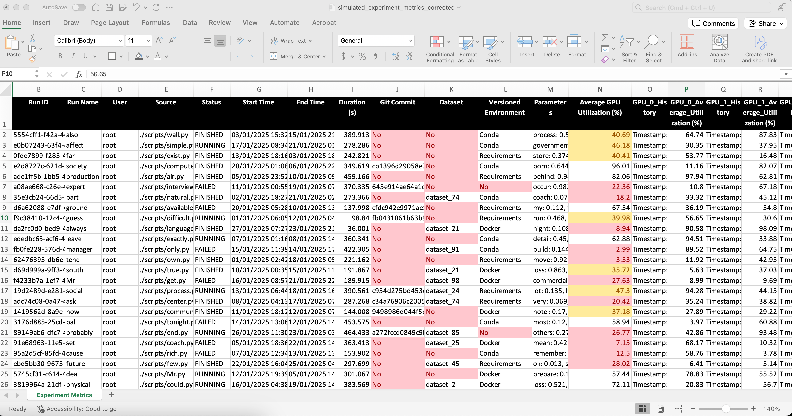

# 360 ML Efficiency Audit Tool

The **360 ML Efficiency Audit Tool** is a Python-based utility designed to fetch and analyze historical data from your experiment tracking platform. This tool helps you gain insights into your machine learning projects by auditing compute usage and resource utilization.

## Features

- Fetch historical metrics, parameters, and metadata for all experiments.
- Analyze GPU and CPU utilization metrics, including full metric history for GPUs.
- List all registered models and their versions.
- Export results to a detailed Excel report, including a summary and raw data.

Gain insights into your machine learning projects by auditing compute usage and resource utilization.

**Utilization / Cost**
* Are you using the optimal machine sizes for your workloads?
* How often do you have idle GPU or entire machines?
* Is your compute going to waste by repeating experiments with no changes?

**Efficiency:**
* How many experiments are you cranking out each week?
* Are you running experiments in parallel to boost efficiency?

**Versioning**
* Are your experiments getting versioned regularly?
* Do your models include proper versioning metadata?




## Folder Structure

```
360-ML-Efficiency-Audit-Tool/
│
├── mlflow_efficiency_audit.py    # Main script
├── .env                          # MLFlow Tracking URI configuration
│
├── README.md                     # Documentation
├── requirements.txt              # Required Python librarie
```

## Installation

### Prerequisites

- Python 3.8 or higher
- An active MLflow tracking server
- Turn on [MLFlow System Metrics monitoring](https://mlflow.org/docs/latest/system-metrics/index.html)

### Setup

1. Clone this repository:
   ```bash
   git clone https://github.com/valohai/360-ml-efficiency-audit.git
   cd 360-ML-Efficiency-Audit-Tool
   ```

2. Install the required dependencies:
   ```bash
   pip install -r requirements.txt
   ```

3. Configure your MLflow tracking URI in the `.env` file. For example:
```
MLFLOW_TRACKING_URI=http://3.128.246.34
```

## Usage

1. Run the script to generate the audit report:
   ```bash
   python mlflow/efficiency_audit.py
   ```

1. The report will be saved as `experiment_metrics_summary.xlsx` in the current directory.

## Requirements

The project dependencies are listed in `requirements.txt`:
- `mlflow` – Interact with MLflow tracking server.
- `pandas` – Data processing and analysis.
- `openpyxl` – Generate Excel reports.
- `python-dotenv` – Manage environment variables.

Install them using:
```bash
pip install -r requirements.txt
```
